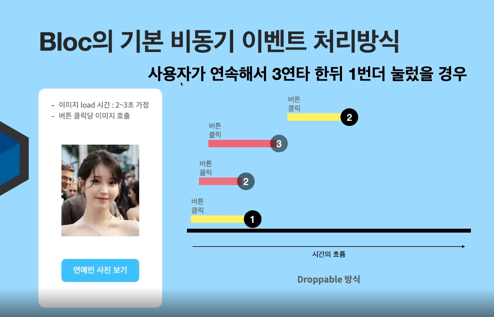
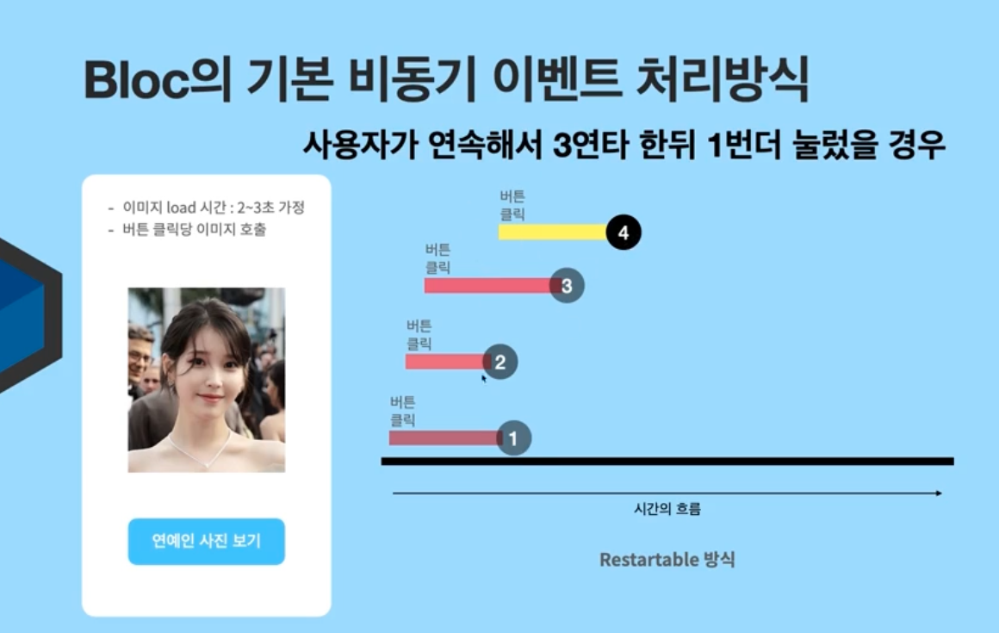

### Bloc만 있는 기능
상태변화 모니터링을 이벤트로 확인가능

'''
    @override
    void onTransition(Transition<CountEvent, int> transition){
        super.onTransition(transition);
        print(transition);
    }
'''
=> 결과값은 Transition {currentState: 0, event: AddCountEvent(), nextState: 1}
처럼 어떤 이벤트에 의해 state가 어떻게 변화되어ㅆ는지를 확인할 수 있다.

=> 1초동안 대기했다가 위 함수를 실행한다.

### Bloc의 비동기 이벤트 처리방식
사용자가 버튼에 아무리 많은 연타를 한다해도 하나의 버튼 클릭 이벤트가 끝내고 난 후에 다음 이벤트를 수행한다.

아무리 많은 클릭을 해도 가장 마지막에 수행된 이벤트만 수행한다.
서버의 부하를 줄이는 가장 적절한 방법일 수 있다.
