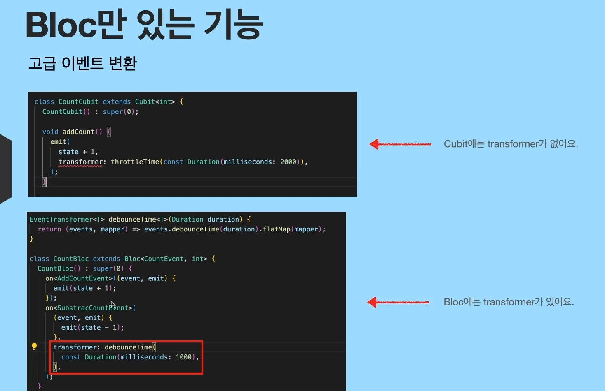

### Bloc만 있는 기능
상태변화 모니터링을 이벤트로 확인가능

'''
    @override
    void onTransition(Transition<CountEvent, int> transition){
        super.onTransition(transition);
        print(transition);
    }
'''
=> 결과값은 Transition {currentState: 0, event: AddCountEvent(), nextState: 1}
처럼 어떤 이벤트에 의해 state가 어떻게 변화되어ㅆ는지를 확인할 수 있다.

=> 1초동안 대기했다가 위 함수를 실행한다.