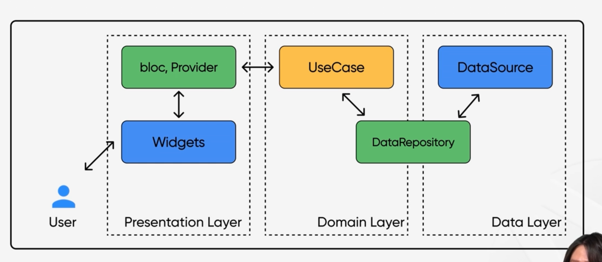

### 클릭아키텍처 개념
- 역할별로 경계를 나눠서 구성요소를 서로 분리하고, 경계에 있는 요소가 반대편이 있는 요소를 알지 못하게 한다.

### 왜 계층을 나눠야할까?

01. 분리된 책임과 유지보수성
- 계층별로 책임을 분리
- 한 계층의 변경이 다른 계층에 영향을 미치지 않음
- 이로 인해 유지보수성 향상

02. 유연성과 확장성
- 계층의 외부 의존성을 내로부터 격리
- 새운 요구사항이나 기존 기능 변경이 쉬움

03. 테스트 용이성과 안전성
- 계층별 독립적인 테스트 가능
- 단위테스트 및 통합테스트 작성에 용이

04. 팀 간 협업 용이성
- 분리된 계층별로 작업이 가능
- 서로의 작업 결과물에 영향을 덜 받게 됨

### 클린 아키텍처 기본 원칙:

01. 의존성 역전 원칙(DIP)
- 고수준 모듈이 저수준 모듈에 의존해서는 안되며 추상화에 의존해야 함
- 내부 계층이 외부 계층의 구현 세부사항에 의존하지 않도록 구현
- 시스템의 구현사항이 내부 로직에 영향을 주지 않도록 보장함

02. 단일 책임 원칙(SRP)
- 소프트웨어의 모듈이나 클래스는 하나의 책임만 가져야 함
- 관심사를 분리하여 각 계층은 고유의 책임을 가질 수 있도록 설계해야 함
- 변경 사항이 발생할 때 시스템의 한정된 부분에만 영향을 미치도록 보장

03. 개방 폐쇄 원칙(OCP)
- 클래스, 모듈, 함수 등은 확장에는 열려 있어야 하지만, 변경에는 닫혀 있어야 함
- 계층별로 분리된 코드는 기존의 코드를 변경하지 않고도 새로운 변경사항을 반영할 수 있음

### 프레임워크와 드라이버 계층
- 사용자 인터페이스, 웹 프레임워크, 데이터 베이스 및 외부시스템과 같은 외부문제를 처리하는 가장 바깥쪽 계층
- 외부시스템과의 인터페이스 역할을 담당
- 외부시스템과 내부 계층에서 생성한 데이터를 각 계층에서 이해하기 쉬운 형태로 변환
- 해당 계층을 통해 외부 시스템과의 결합도를 최소화하고, 앱의 유연성과 확장성을 확장시킨다.

#### 드라이버 계층 요소
- 데이터 소스: 로컬 스토리지나 원격 서버의 통신을 담당하는 API 연동부분
- 레포지토리 구현체: 데이터 소스와 상호작용하여 앱에 필요한 데이터를 가져오고 저장하는 역할을 하는 레포지토리 구현체
- 플랫폼 특화 코드: 안드로이드와 iOS 플랫폼 등 플랫폼에 종속적인 코드들도 포함됨

### 인터페이스 어댑터 계층
- 도메인 계층의 상위 비즈니스 규칙과 프레임워크 및 드라이버 계층의 외부 관심사 사이의 가교역할을 하는 계층
- 도메인 계층의 데이터를 사용자 인터페이스에 표시하거나, 그 반대로 표시하는 데 필요한 메커니즘을 제공
- 도메인 계층의 비즈니스 로직을 프레임워크, 드라이버 계층에서 분리하여 계층간 의존성을 낮춤

### 도메인 계층
- 비즈니스 로직을 캡슐화하여 서로 다른 엔티티 간의 상호작용을 정의하는 계층
- 도메인 로직 실행: 유스케이스는 사용자의 요구사항에 맞춰 도메인 로직을 실행하는 핵심역할을 담당
- 캡슐화와 독립성: 도메인의 규칙과 데이터 조작을 도메인 계층을 통해 캡슐화하여 독립성을 유지
- 유스케이스로 비즈니스로직을 구현하고, 다른 계층에서 사용함

### 엔티티 계층
- 핵심 비즈니스 개체 및 개념을 나타내는 단순한 데이터 클래스가 포함된 계층
- 앱의 핵심 개념을 표현하는 중요한 데이터 모델
- 비즈니스 로직에 중요한 역할을 캡슐화하여 각 계층에 독립성을 강화하고 유연성을 확보한다.

 

